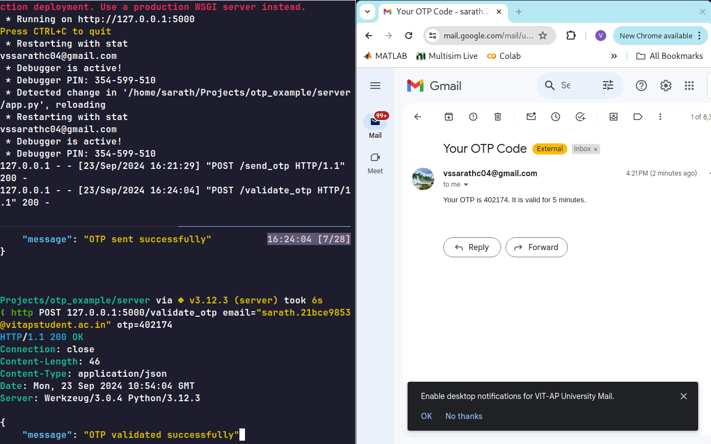
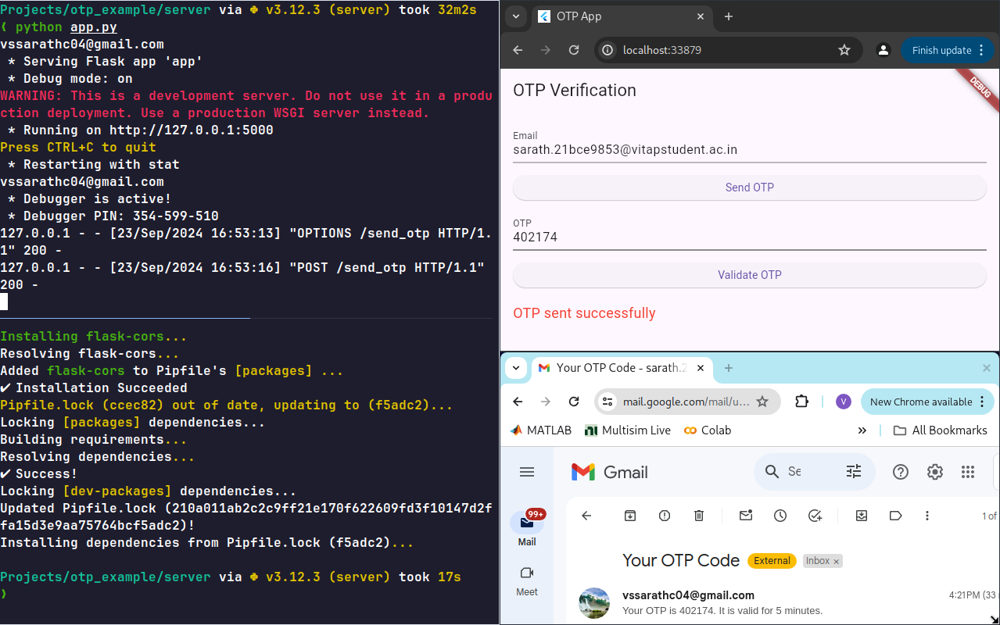

# A simple show case of server-client with flutter 

# Demo 
The image demo with curl


---

The image demo with flutter


## Setup 
Sarting the server
```bash
# go to the server/ folder
cd server 

# install the requirements
pipenv install

# start the venv 
pipenv shell 

# run the app 
python main.py
```

Running the app 
```bash 
# Install the deps
flutter pub get

# run the app 
flutter run
```
